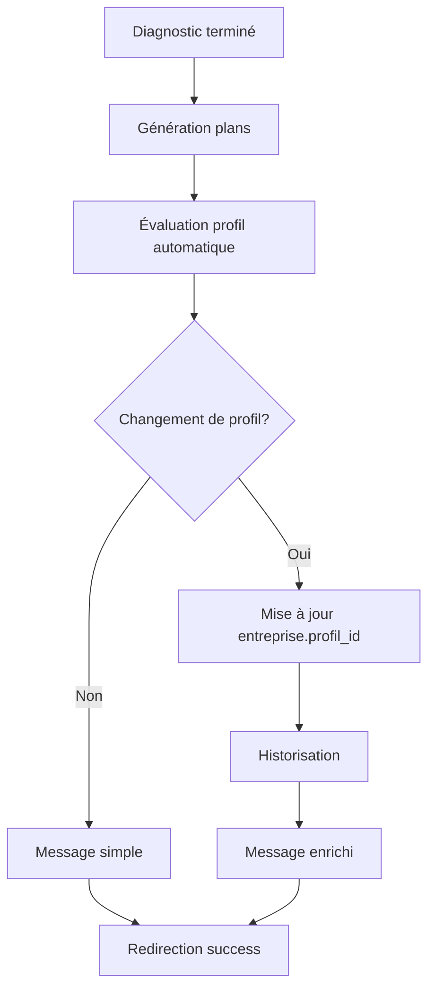

# 🎯 **Intégration du DiagnosticStatutService dans DiagnosticentrepriseController**

---

## 📋 **Vue d'ensemble**

Le `DiagnosticentrepriseController` a été enrichi pour évaluer automatiquement les profils d'entreprise (PÉPITE/ÉMERGENTE/ÉLITE) après chaque diagnostic terminé.

---

## 🔧 **Modifications apportées**

### **1. Injection du service**

```php
use App\Services\DiagnosticStatutService;

class DiagnosticentrepriseController extends Controller
{
    protected $diagnosticStatutService;

    public function __construct(DiagnosticStatutService $diagnosticStatutService)
    {
        $this->diagnosticStatutService = $diagnosticStatutService;
    }
}
```

---

### **2. Évaluation automatique dans `store()`**

```php
// 🎯 GÉNÉRATION AUTOMATIQUE DES PLANS D'ACCOMPAGNEMENT
$this->genererPlansAutomatiques($diagnostic);

// 🎯 ÉVALUATION AUTOMATIQUE DU PROFIL D'ENTREPRISE (PÉPITE/ÉMERGENTE/ÉLITE)
$resultatProfil = $this->diagnosticStatutService->evaluerProfilEntreprise($entrepriseId);

// Préparer le message de succès avec information sur le profil
$messageSucces = "✅ Diagnostic terminé. Score : {$totalScore}";
if ($resultatProfil['changement_effectue']) {
    $messageSucces .= " | " . $resultatProfil['message'];
}
```

---

### **3. Nouvelles méthodes ajoutées**

#### **Évaluation manuelle du profil**
```php
public function evaluerProfil($entrepriseId)
{
    // Vérification des permissions
    // Évaluation du profil
    // Retour JSON avec résultat
}
```

#### **Historique des profils**
```php
public function getHistoriqueProfils($entrepriseId, $limit = 10)
{
    // Vérification des permissions
    // Récupération de l'historique
    // Retour JSON avec historique
}
```

---

### **4. Routes ajoutées**

```php
// Évaluation du profil
Route::post('/entreprises/{entrepriseId}/profil/evaluer', 'DiagnosticentrepriseController@evaluerProfil')
    ->name('entreprise.profil.evaluer');

// Historique des profils
Route::get('/entreprises/{entrepriseId}/profil/historique', 'DiagnosticentrepriseController@getHistoriqueProfils')
    ->name('entreprise.profil.historique');
```

---

## 🎯 **Workflow d'évaluation**

### **Processus automatique**


### **Messages utilisateur**
#### **Avec changement de profil :**
```
✅ Diagnostic terminé. Score : 165 | 🎉 Félicitations ! Après 3.2 mois dans le statut PÉPITE et une excellente progression, votre entreprise accède au statut ÉMERGENTE !
```

#### **Sans changement :**
```
✅ Diagnostic terminé. Score : 142
```

---

## 🎮 **Utilisation**

### **1. Évaluation automatique (après diagnostic)**
```php
// Se produit automatiquement dans la méthode store()
// Aucune action manuelle requise
```

### **2. Évaluation manuelle (API)**
```javascript
// POST /entreprises/{entrepriseId}/profil/evaluer
fetch(`/entreprises/${entrepriseId}/profil/evaluer`, {
    method: 'POST',
    headers: {
        'X-CSRF-TOKEN': token,
        'Content-Type': 'application/json'
    }
})
.then(response => response.json())
.then(data => {
    console.log(data.data);
    // Résultat :
    // {
    //   "changement_effectue": true,
    //   "ancien_profil": 1,
    //   "nouveau_profil": 2,
    //   "delai_mois": 3.2,
    //   "score_global": 165,
    //   "message": "🎉 Félicitations !..."
    // }
});
```

### **3. Historique des profils**
```javascript
// GET /entreprises/{entrepriseId}/profil/historique
fetch(`/entreprises/${entrepriseId}/profil/historique`)
.then(response => response.json())
.then(data => {
    console.log(data.data);
    // Résultat :
    // [
    //   {
    //     "ancien_profil_libelle": "PÉPITE",
    //     "nouveau_profil_libelle": "ÉMERGENTE",
    //     "raison": "Progression naturelle après 3.2 mois",
    //     "score_global": 165,
    //     "delai_mois": 3.2,
    //     "created_at": "2024-02-05T19:20:00.000000Z"
    //   }
    // ]
});
```

---

## 🔒 **Sécurité**

### **Permissions vérifiées**
```php
// Uniquement les membres de l'entreprise ou les admins
$entrepriseMembre = Entreprisemembre::where('membre_id', $membre->id)
    ->where('entreprise_id', $entrepriseId)
    ->first();

if (!$entrepriseMembre && !Auth::user()->hasRole('admin')) {
    return response()->json(['success' => false, 'message' => 'Accès non autorisé'], 403);
}
```

---

## 📊 **Cas d'usage**

### **Scénario 1 : Première évaluation**
```
1. Entreprise crée son premier diagnostic
2. Diagnostic terminé → Score : 142
3. Évaluation automatique → Profil : PÉPITE (score < 120)
4. Message : "✅ Diagnostic terminé. Score : 142"
```

### **Scénario 2 : Progression PÉPITE → ÉMERGENTE**
```
1. Entreprise (PÉPITE) refait un diagnostic après 4 mois
2. Diagnostic terminé → Score : 168
3. Évaluation automatique → Profil : ÉMERGENTE (score ≥ 160, délai ≥ 3 mois)
4. Message : "✅ Diagnostic terminé. Score : 168 | 🎉 Félicitations ! Après 4 mois..."
```

### **Scénario 3 : Rétrogradation ÉLITE → ÉMERGENTE**
```
1. Entreprise (ÉLITE) refait un diagnostic
2. Diagnostic terminé → Score : 155
3. Évaluation automatique → Profil : ÉMERGENTE (score < 160)
4. Message : "✅ Diagnostic terminé. Score : 155 | 📋 Mise à jour du profil : ÉLITE → ÉMERGENTE"
```

---

## 🎯 **Avantages**

### **✅ Automatisation complète**
- Évaluation transparente pour l'utilisateur
- Historisation automatique
- Messages informatifs personnalisés

### **✅ Traçabilité**
- Historique complet des changements
- Raisons des changements
- Délais respectés

### **✅ Flexibilité**
- Évaluation manuelle possible
- API pour intégration externe
- Permissions granulaires

---

## 🚀 **Prochaines étapes**

1. **Interface utilisateur** : Dashboard pour visualiser les profils
2. **Notifications** : Alertes email lors des changements
3. **Export** : Rapports PDF des évaluations
4. **Widget** : Affichage du profil actuel dans le tableau de bord

**L'intégration est maintenant complète et fonctionnelle !** 🎯✨
