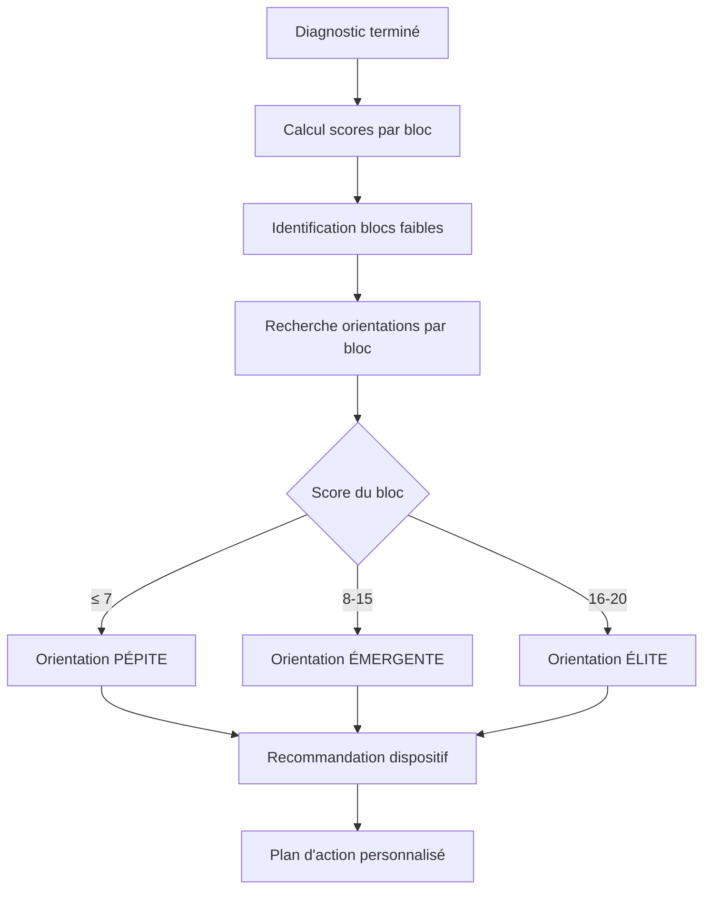

# 🔧 **Correction de la structure des Diagnosticorientations**

---

## ❌ **Problème identifié**

Vous aviez encore raison ! La structure des `diagnosticorientations` était incorrecte :

### **Structure incorrecte :**
```sql
diagnosticorientations
├── diagnosticmodule_id (✅ correct)
├── diagnosticstatut_id (❌ devrait être diagnosticblocstatut_id)
├── seuil_max (✅ correct)
└── dispositif (✅ correct)
```

### **❌ Problème logique :**
Les orientations étaient liées aux **statuts** (Éligible, Non éligible) au lieu des **blocs** (Finance, Juridique, etc.).

### **✅ Logique correcte :**
Les orientations doivent être liées aux **blocs fonctionnels** pour recommander des dispositifs spécifiques selon le domaine de faiblesse.

---

## 🎯 **Exemples concrets**

### **❌ Ancienne logique (incorrecte) :**
```
Statut : Éligible → Dispositif : "Accompagnement complet"
Statut : Non éligible → Dispositif : "Orientation partenaires"
```

### **✅ Nouvelle logique (correcte) :**
```
Bloc Finance < 8 → Dispositif : "CGA / comptabilité simplifiée"
Bloc Juridique < 8 → Dispositif : "Formalisation / RCCM / NIF"
Bloc Marketing < 8 → Dispositif : "Positionnement & offre"
Bloc Commercial < 8 → Dispositif : "Sous traitance Premiers Deals"
```

---

## 🏗️ **Modifications apportées**

### **1. Migration de correction**
```php
// Renommer l'ancienne colonne pour sauvegarde
$table->renameColumn('diagnosticstatut_id', 'ancien_diagnosticstatut_id');

// Ajouter la nouvelle colonne correcte
$table->unsignedBigInteger('diagnosticblocstatut_id')->nullable();

// Ajouter la clé étrangère correcte
$table->foreign('diagnosticblocstatut_id')->references('id')->on('diagnosticblocstatuts');
```

### **2. Modèle mis à jour**
```php
class Diagnosticorientation extends Model
{
    protected $fillable = [
        'diagnosticmodule_id',      // ✅ Module spécifique
        'diagnosticblocstatut_id',  // ✅ Bloc spécifique (CORRIGÉ)
        'seuil_max',              // ✅ Seuil de score
        'dispositif',              // ✅ Dispositif recommandé
    ];

    // ✅ Nouvelle relation correcte
    public function diagnosticblocstatut()
    {
        return $this->belongsTo(Diagnosticblocstatut::class);
    }
}
```

### **3. Méthodes mises à jour**
```php
// ✅ Chargement du bloc au lieu du statut
->with(['diagnosticblocstatut'])

// ✅ Scope pour un bloc spécifique
public function scopePourBloc($query, $blocId)
{
    return $query->where('diagnosticblocstatut_id', $blocId);
}
```

---

## 🎯 **Nouvelle structure des orientations**

### **1. Orientations par bloc**
```php
// Bloc Finance - 3 niveaux d'orientation
Diagnosticorientation::create([
    'diagnosticblocstatut_id' => $blocFinance->id,
    'seuil_max' => 7,
    'dispositif' => 'CGA / comptabilité simplifiée',
]);

Diagnosticorientation::create([
    'diagnosticblocstatut_id' => $blocFinance->id,
    'seuil_max' => 15,
    'dispositif' => 'CGA / préparation financement',
]);

Diagnosticorientation::create([
    'diagnosticblocstatut_id' => $blocFinance->id,
    'seuil_max' => 20,
    'dispositif' => 'Accès financement structuré (banques, investisseurs)',
]);
```

### **2. Orientations par module**
```php
// Pour un module spécifique
Diagnosticorientation::create([
    'diagnosticmodule_id' => $module->id,
    'diagnosticblocstatut_id' => null,
    'seuil_max' => 8,
    'dispositif' => "Accompagnement spécifique - Module : {$module->titre}",
]);
```

---

## 📊 **Mapping complet des orientations**

### **🎯 Bloc Stratégie**
| Score | Dispositif |
|-------|-------------|
| ≤ 7 | CIJET – Structuration stratégique |
| ≤ 15 | CIJET – stratégie & gouvernance |
| ≤ 20 | Scaling & Expansion |

### **💰 Bloc Finance & Comptabilité**
| Score | Dispositif |
|-------|-------------|
| ≤ 7 | CGA / comptabilité simplifiée |
| ≤ 15 | CGA / préparation financement |
| ≤ 20 | Accès financement structuré (banques, investisseurs) |

### **⚖️ Bloc Juridique**
| Score | Dispositif |
|-------|-------------|
| ≤ 7 | Formalisation / RCCM / NIF |
| ≤ 15 | Mise en conformité avancée |
| ≤ 20 | Structuration juridique avancée (holding, filiales) |

### **👥 Bloc Ressources Humaines**
| Score | Dispositif |
|-------|-------------|
| ≤ 7 | Mise en place RH de base |
| ≤ 15 | Structuration RH & social |
| ≤ 20 | Leadership & gouvernance RH |

### **📢 Bloc Marketing**
| Score | Dispositif |
|-------|-------------|
| ≤ 7 | Positionnement & offre |
| ≤ 15 | Positionnement & branding |
| ≤ 20 | Branding national / régional |

### **💼 Bloc Commercial**
| Score | Dispositif |
|-------|-------------|
| ≤ 7 | Sous traitance Premiers Deals |
| ≤ 15 | Premiers Deals avancé |
| ≤ 20 | Accès marchés structurés (grands comptes, B2G) |

### **⚙️ Bloc Opérations**
| Score | Dispositif |
|-------|-------------|
| ≤ 7 | Organisation & process |
| ≤ 15 | Optimisation & process |
| ≤ 20 | Passage à l'échelle & excellence opérationnelle |

### **💻 Bloc Digital**
| Score | Dispositif |
|-------|-------------|
| ≤ 7 | Digitalisation de base |
| ≤ 15 | Digitalisation & outils |
| ≤ 20 | Transformation digitale avancée |

### **📋 Bloc Administration**
| Score | Dispositif |
|-------|-------------|
| ≤ 7 | Structuration administrative |
| ≤ 15 | Gouvernance & reporting |
| ≤ 20 | Gouvernance multi-activités & reporting stratégique |

---

## 🔄 **Workflow d'orientation**



---

## 🎮 **Utilisation pratique**

### **1. Obtenir les orientations pour un bloc**
```php
$blocFinance = Diagnosticblocstatut::where('code', 'FINANCE')->first();
$orientations = Diagnosticorientation::where('diagnosticblocstatut_id', $blocFinance->id)
    ->where('seuil_max', '>=', $scoreFinance)
    ->orderBy('seuil_max', 'asc')
    ->get();
```

### **2. Obtenir le dispositif recommandé**
```php
$scoreFinance = 6; // Bloc faible
$dispositif = Diagnosticorientation::getDispositifRecommande($moduleId, $scoreFinance);
// Résultat : "CGA / comptabilité simplifiée"
```

### **3. Orientations combinées**
```php
// Plusieurs blocs faibles = parcours combiné
$blocsFaibles = ['FINANCE' => 6, 'JURIDIQUE' => 5];
$orientationsCombinees = [];

foreach ($blocsFaibles as $blocCode => $score) {
    $bloc = Diagnosticblocstatut::where('code', $blocCode)->first();
    $orientation = Diagnosticorientation::where('diagnosticblocstatut_id', $bloc->id)
        ->where('seuil_max', '>=', $score)
        ->first();
    $orientationsCombinees[] = $orientation;
}
```

---

## 🚀 **Installation**

### **1. Exécuter la migration :**
```bash
php artisan migrate
```

### **2. Lancer le seeder corrigé :**
```bash
php artisan db:seed --class=DiagnosticOrientationsCorrectedSeeder
```

### **3. Vérifier les données :**
```sql
SELECT do.dispositif, db.code as bloc_code, do.seuil_max
FROM diagnosticorientations do
JOIN diagnosticblocstatuts db ON do.diagnosticblocstatut_id = db.id
ORDER BY db.code, do.seuil_max;
```

---

## 🎯 **Avantages de la correction**

### **✅ Précision des recommandations**
- Orientations spécifiques par domaine
- Dispositifs adaptés au niveau de maturité
- Parcours personnalisés

### **✅ Logique métier cohérente**
- Bloc faible → Dispositif de renforcement
- Plusieurs blocs faibles → Parcours combiné
- Progression structurée

### **✅ Flexibilité**
- Ajout facile de nouveaux dispositifs
- Modification des seuils par bloc
- Évolution des parcours

---

## 📋 **Résumé**

La structure corrigée permet maintenant :

1. **🎯 Orientations par bloc** : Spécifiques à chaque domaine fonctionnel
2. **🎯 Orientations par module** : Pour des besoins très spécifiques
3. **🎯 Parcours combinés** : Plusieurs blocs faibles = accompagnement multi-domaines
4. **🎯 Progression logique** : PÉPITE → ÉMERGENTE → ÉLITE

**Votre intuition était encore parfaite ! Les orientations sont maintenant logiquement cohérentes et beaucoup plus pertinentes.** 🎯✨
