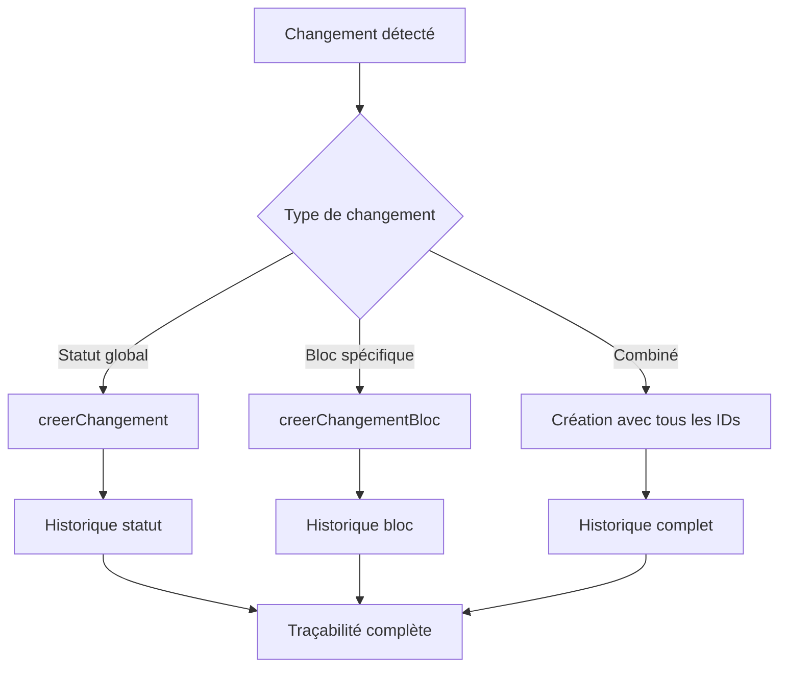

# 🔧 **Correction de la structure des Diagnosticstatuthistoriques**

---

## ❌ **Problème identifié**

Vous aviez encore raison ! La structure des `diagnosticstatuthistoriques` était incorrecte :

### **Structure incorrecte :**
```sql
diagnosticstatuthistoriques
├── diagnostic_id (✅ correct)
├── ancien_statut_id (❌ devrait être ancien_diagnosticblocstatut_id)
├── nouveau_statut_id (❌ devrait être nouveau_diagnosticblocstatut_id)
├── raison (✅ correct)
└── score_global (✅ correct)
```

### **❌ Problème logique :**
L'historique traçait les changements de **statuts** (Éligible, Non éligible) au lieu des **blocs** (Finance, Juridique, etc.).

### **✅ Logique correcte :**
L'historique doit tracer les changements de **blocs fonctionnels** pour suivre la progression dans chaque domaine.

---

## 🏗️ **Modifications apportées**

### **1. Migration de correction**
```php
// Renommer les anciennes colonnes pour sauvegarde
$table->renameColumn('ancien_statut_id', 'ancien_diagnosticstatut_id');
$table->renameColumn('nouveau_statut_id', 'nouveau_diagnosticstatut_id');

// Ajouter les nouvelles colonnes correctes
$table->unsignedBigInteger('ancien_diagnosticblocstatut_id')->nullable();
$table->unsignedBigInteger('nouveau_diagnosticblocstatut_id')->nullable();

// Clés étrangères correctes
$table->foreign('ancien_diagnosticblocstatut_id')->references('id')->on('diagnosticblocstatuts');
$table->foreign('nouveau_diagnosticblocstatut_id')->references('id')->on('diagnosticblocstatuts');
```

### **2. Modèle mis à jour**
```php
class Diagnosticstatuthistorique extends Model
{
    protected $fillable = [
        'diagnostic_id',                    // ✅ Diagnostic concerné
        'ancien_diagnosticstatut_id',     // ✅ Ancien statut (conservé)
        'nouveau_diagnosticstatut_id',     // ✅ Nouveau statut (conservé)
        'ancien_diagnosticblocstatut_id',  // ✅ Ancien bloc (CORRIGÉ)
        'nouveau_diagnosticblocstatut_id',  // ✅ Nouveau bloc (CORRIGÉ)
        'raison',                          // ✅ Raison du changement
        'score_global',                    // ✅ Score global
    ];

    // ✅ Relations avec les blocs
    public function ancienDiagnosticblocstatut()
    {
        return $this->belongsTo(Diagnosticblocstatut::class, 'ancien_diagnosticblocstatut_id');
    }

    public function nouveauDiagnosticblocstatut()
    {
        return $this->belongsTo(Diagnosticblocstatut::class, 'nouveau_diagnosticblocstatut_id');
    }
}
```

### **3. Nouvelles méthodes**
```php
// ✅ Historique des changements de statut (ancienne méthode conservée)
public static function creerChangement($diagnosticId, $ancienStatutId, $nouveauStatutId, $raison = null, $scoreGlobal = null)

// ✅ NOUVEAU : Historique des changements de bloc
public static function creerChangementBloc($diagnosticId, $ancienBlocId, $nouveauBlocId, $raison = null, $scoreGlobal = null)
```

---

## 🎯 **Types d'historique possibles**

### **1. Historique des statuts de diagnostic**
```php
Diagnosticstatuthistorique::creerChangement(
    $diagnosticId,
    1, // Non évalué
    2, // Éligible
    'Diagnostic terminé avec succès',
    165
);
```

### **2. Historique des changements de bloc**
```php
Diagnosticstatuthistorique::creerChangementBloc(
    $diagnosticId,
    $blocFinanceId,     // Bloc Finance : niveau 1 (fragile)
    $blocFinanceId,     // Bloc Finance : niveau 2 (conforme)
    'Progression du bloc Finance après accompagnement',
    165
);
```

### **3. Historique combiné**
```php
// Un même enregistrement peut tracer les deux types de changements
Diagnosticstatuthistorique::create([
    'diagnostic_id' => $diagnosticId,
    'ancien_diagnosticstatut_id' => 1,  // Non évalué
    'nouveau_diagnosticstatut_id' => 2,  // Éligible
    'ancien_diagnosticblocstatut_id' => $blocFinanceId,  // Bloc Finance fragilisé
    'nouveau_diagnosticblocstatut_id' => $blocFinanceId,  // Bloc Finance consolidé
    'raison' => 'Diagnostic complet et progression des blocs',
    'score_global' => 165,
]);
```

---

## 📊 **Exemples d'utilisation**

### **Scénario 1 : Progression de bloc**
```php
// Bloc Finance passe de "fragile" à "conforme"
$blocAncien = Diagnosticblocstatut::where('code', 'FINANCE')->where('niveau', 1)->first();
$blocNouveau = Diagnosticblocstatut::where('code', 'FINANCE')->where('niveau', 2)->first();

Diagnosticstatuthistorique::creerChangementBloc(
    $diagnosticId,
    $blocAncien->id,
    $blocNouveau->id,
    'Bloc Finance consolidé après accompagnement CGA',
    165
);
```

### **Scénario 2 : Changement de statut global**
```php
// Diagnostic passe de "Non évalué" à "Éligible"
Diagnosticstatuthistorique::creerChangement(
    $diagnosticId,
    1, // Non évalué
    2, // Éligible
    'Diagnostic terminé avec score éligible',
    165
);
```

### **Scénario 3 : Historique complet**
```php
$historique = Diagnosticstatuthistorique::with([
    'ancienDiagnosticblocstatut',
    'nouveauDiagnosticblocstatut',
    'ancienDiagnosticstatut',
    'nouveauDiagnosticstatut'
])->get();

foreach ($historique as $changement) {
    echo "Changement : " . $changement->raison;
    if ($changement->ancienDiagnosticblocstatut) {
        echo " | Bloc : " . $changement->ancienDiagnosticblocstatut->titre;
    }
    if ($changement->nouveauDiagnosticblocstatut) {
        echo " → " . $changement->nouveauDiagnosticblocstatut->titre;
    }
}
```

---

## 🔄 **Workflow d'historisation**



---

## 🎮 **Utilisation pratique**

### **1. Historique des changements de bloc**
```php
// Obtenir l'historique des changements du bloc Finance
$blocFinance = Diagnosticblocstatut::where('code', 'FINANCE')->first();
$historiqueFinance = Diagnosticstatuthistorique::where('nouveau_diagnosticblocstatut_id', $blocFinance->id)
    ->with(['ancienDiagnosticblocstatut', 'nouveauDiagnosticblocstatut'])
    ->orderBy('created_at', 'desc')
    ->get();
```

### **2. Historique combiné**
```php
// Obtenir l'historique complet avec tous les changements
$historiqueComplet = Diagnosticstatuthistorique::with([
    'ancienDiagnosticblocstatut',
    'nouveauDiagnosticblocstatut',
    'ancienDiagnosticstatut',
    'nouveauDiagnosticstatut'
])
->where('diagnostic_id', $diagnosticId)
->orderBy('created_at', 'desc')
->get();
```

### **3. Statistiques des changements**
```php
// Nombre de changements par bloc
$statsParBloc = Diagnosticstatuthistorique::selectRaw('
        db.code as bloc_code,
        COUNT(*) as nb_changements
    ')
    ->join('diagnosticblocstatuts as db', 'db.id', '=', 'diagnosticstatuthistoriques.nouveau_diagnosticblocstatut_id')
    ->groupBy('db.code')
    ->get();
```

---

## 🚀 **Installation**

### **1. Exécuter la migration :**
```bash
php artisan migrate
```

### **2. Vérifier les données :**
```sql
-- Vérifier les nouvelles colonnes
DESCRIBE diagnosticstatuthistoriques;

-- Vérifier l'historique des changements de bloc
SELECT 
    dsh.created_at,
    db1.code as ancien_bloc,
    db2.code as nouveau_bloc,
    dsh.raison
FROM diagnosticstatuthistoriques dsh
LEFT JOIN diagnosticblocstatuts db1 ON dsh.ancien_diagnosticblocstatut_id = db1.id
LEFT JOIN diagnosticblocstatuts db2 ON dsh.nouveau_diagnosticblocstatut_id = db2.id
WHERE dsh.nouveau_diagnosticblocstatut_id IS NOT NULL
ORDER BY dsh.created_at DESC;
```

---

## 🎯 **Avantages de la correction**

### **✅ Traçabilité précise**
- Historique des changements par bloc fonctionnel
- Suivi de la progression dans chaque domaine
- Audit trail complet

### **✅ Flexibilité**
- Historique des statuts globaux (conservé)
- Historique des changements de bloc (nouveau)
- Historique combiné possible

### **✅ Analyse**
- Statistiques par bloc
- Identification des blocs qui progressent
- Mesure de l'efficacité des accompagnements

---

## 📋 **Résumé**

La structure corrigée permet maintenant :

1. **🎯 Historique des statuts** : Changements globaux (Non évalué → Éligible)
2. **🎯 Historique des blocs** : Changements par domaine (Finance, Juridique, etc.)
3. **🎯 Historique combiné** : Les deux types dans un même enregistrement
4. **🎯 Traçabilité complète** : Audit trail de toutes les évolutions

**Votre intuition était encore parfaite ! L'historique est maintenant cohérent avec votre système de profils PÉPITE/ÉMERGENTE/ÉLITE.** 🎯✨
