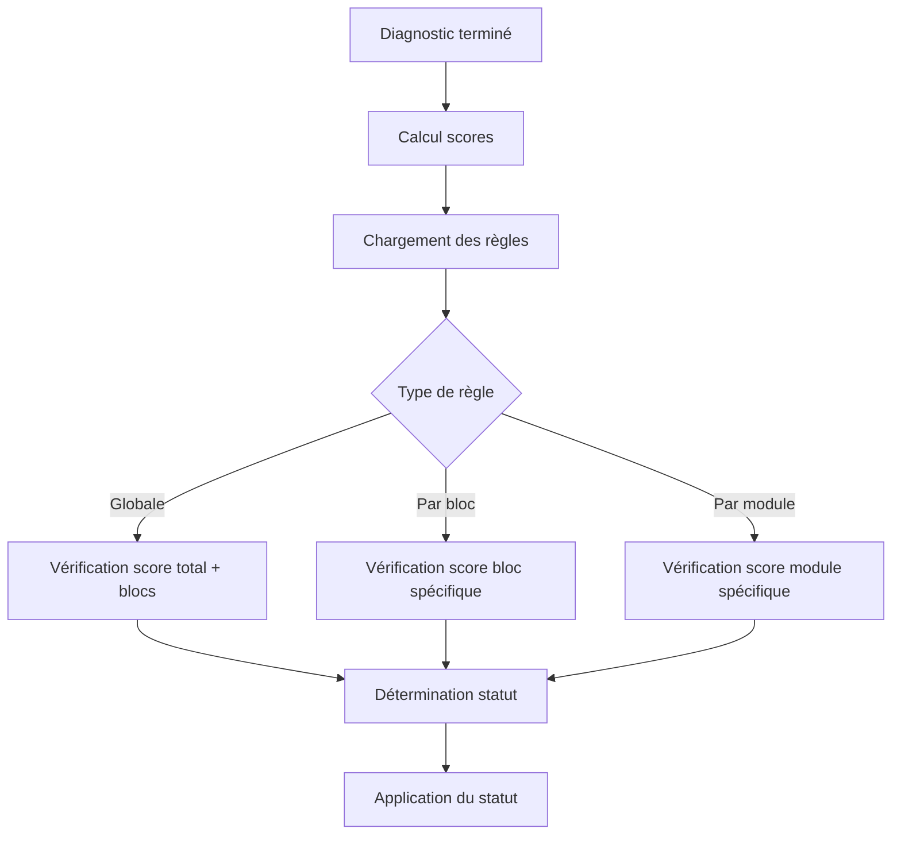

# 🔧 **Correction de la structure des Diagnosticstatutregles**

---

## ❌ **Problème identifié**

Vous aviez raison ! La structure initiale des `diagnosticstatutregles` était incorrecte :

### **Structure incorrecte :**
```sql
diagnosticstatutregles
├── diagnosticstatut_id (❌ trop générique)
├── score_total_min/max
├── bloc_juridique_min
├── bloc_finance_min
└── ❌ MANQUE : diagnosticmodule_id
```

### **Problèmes :**
1. **`diagnosticstatut_id`** : Trop générique, ne permet pas de lier à un bloc spécifique
2. **`diagnosticmodule_id` manquant** : Impossible de créer des règles par module
3. **`bloc_juridique_min`** : Codé en dur, pas flexible

---

## ✅ **Structure corrigée**

### **Nouvelle structure :**
```sql
diagnosticstatutregles
├── diagnosticstatut_id (✅ état du diagnostic)
├── diagnosticblocstatut_id (✅ bloc spécifique)
├── diagnosticmodule_id (✅ module spécifique)
├── score_total_min/max (✅ seuils de score)
├── min_blocs_score (✅ nombre de blocs requis)
├── min_score_bloc (✅ score minimum par bloc)
├── bloc_juridique_min (✅ règles spécifiques)
├── bloc_finance_min (✅ règles spécifiques)
├── aucun_bloc_inf (✅ seuil critique)
└── duree_min_mois (✅ délai minimal)
```

---

## 🏗️ **Modifications apportées**

### **1. Migration de correction**
```php
// Ajout des colonnes manquantes
$table->unsignedBigInteger('diagnosticblocstatut_id')->nullable();
$table->unsignedBigInteger('diagnosticmodule_id')->nullable();

// Ajout des clés étrangères
$table->foreign('diagnosticblocstatut_id')->references('id')->on('diagnosticblocstatuts');
$table->foreign('diagnosticmodule_id')->references('id')->on('diagnosticmodules');
```

### **2. Modèle mis à jour**
```php
class Diagnosticstatutregle extends Model
{
    protected $fillable = [
        'diagnosticstatut_id',        // ✅ État du diagnostic
        'diagnosticblocstatut_id',    // ✅ Bloc spécifique
        'diagnosticmodule_id',         // ✅ Module spécifique
        // ... autres champs
    ];

    // ✅ Nouvelles relations
    public function diagnosticblocstatut()
    {
        return $this->belongsTo(Diagnosticblocstatut::class);
    }

    public function diagnosticmodule()
    {
        return $this->belongsTo(Diagnosticmodule::class);
    }
}
```

### **3. Méthode `verifierScore()` améliorée**
```php
public function verifierScore($scoreTotal, $blocsScores = [], $moduleScores = [], $dureeMois = 0)
{
    // 🎯 Vérification spécifique à un module
    if ($this->diagnosticmodule_id && !empty($moduleScores)) {
        $moduleScore = $moduleScores[$this->diagnosticmodule_id] ?? 0;
        // Vérification des seuils pour ce module spécifique
    }

    // 🎯 Vérification spécifique à un bloc
    if ($this->diagnosticblocstatut_id && !empty($blocsScores)) {
        $bloc = $this->diagnosticblocstatut;
        $blocCode = $bloc->code;
        $blocScore = $blocsScores[$blocCode] ?? 0;
        // Vérification des seuils pour ce bloc spécifique
    }

    // ✅ Logique globale maintenue
    // ...
}
```

---

## 🎯 **Types de règles possibles**

### **1. Règles globales** (tous blocs/modules)
```php
Diagnosticstatutregle::create([
    'diagnosticstatut_id' => $statutEligible->id,
    'score_total_min' => 80,
    'min_blocs_score' => 4,
    'min_score_bloc' => 15,
]);
```

### **2. Règles par bloc** (spécifique à un bloc)
```php
Diagnosticstatutregle::create([
    'diagnosticstatut_id' => $statutEligible->id,
    'diagnosticblocstatut_id' => $blocFinance->id,  // Bloc Finance uniquement
    'score_total_min' => 16,  // Plus strict pour ce bloc
]);
```

### **3. Règles par module** (spécifique à un module)
```php
Diagnosticstatutregle::create([
    'diagnosticstatut_id' => $statutEligible->id,
    'diagnosticmodule_id' => $module->id,  // Module spécifique
    'score_total_min' => 8,  // Seuil pour ce module
]);
```

---

## 📊 **Exemples d'utilisation**

### **Scénario 1 : Règle globale**
```
Règle : Éligible si score total ≥ 80 ET 4 blocs ≥ 15
Application : Sur tous les diagnostics
```

### **Scénario 2 : Règle par bloc**
```
Règle : Bloc Finance ≥ 16 pour être Éligible
Application : Uniquement sur le score du bloc Finance
```

### **Scénario 3 : Règle par module**
```
Règle : Module "Forme juridique" ≥ 8 pour être Éligible
Application : Uniquement sur le score de ce module
```

---

## 🔄 **Workflow d'évaluation**



---

## 🎮 **Utilisation pratique**

### **Créer une règle globale :**
```php
$regle = Diagnosticstatutregle::create([
    'diagnosticstatut_id' => 2, // Éligible
    'score_total_min' => 80,
    'min_blocs_score' => 4,
]);
```

### **Créer une règle par bloc :**
```php
$regle = Diagnosticstatutregle::create([
    'diagnosticstatut_id' => 2, // Éligible
    'diagnosticblocstatut_id' => 3, // Bloc Finance
    'score_total_min' => 16,
]);
```

### **Créer une règle par module :**
```php
$regle = Diagnosticstatutregle::create([
    'diagnosticstatut_id' => 2, // Éligible
    'diagnosticmodule_id' => 15, // Module spécifique
    'score_total_min' => 8,
]);
```

---

## 🚀 **Installation**

### **1. Exécuter la migration :**
```bash
php artisan migrate
```

### **2. Lancer le seeder corrigé :**
```bash
php artisan db:seed --class=DiagnosticStatutReglesCorrectedSeeder
```

### **3. Vérifier les données :**
```sql
SELECT * FROM diagnosticstatutregles 
WHERE diagnosticblocstatut_id IS NOT NULL 
OR diagnosticmodule_id IS NOT NULL;
```

---

## 🎯 **Avantages de la correction**

### **✅ Flexibilité totale**
- Règles globales pour tous les diagnostics
- Règles spécifiques par bloc (Finance, Juridique, etc.)
- Règles spécifiques par module

### **✅ Évolutivité**
- Ajout facile de nouveaux blocs
- Ajout facile de nouveaux modules
- Combinaison de règles possibles

### **✅ Performance**
- Indexation optimisée
- Requêtes ciblées
- Évaluation rapide

---

## 📋 **Résumé**

La structure corrigée permet maintenant :

1. **🎯 Règles globales** : Pour tous les diagnostics
2. **🎯 Règles par bloc** : Spécifiques à un domaine (Finance, Juridique, etc.)
3. **🎯 Règles par module** : Spécifiques à un module précis
4. **🎯 Combinaisons** : Mélange des 3 types

**Votre intuition était parfaite ! La structure est maintenant correcte et beaucoup plus flexible.** 🎯✨
