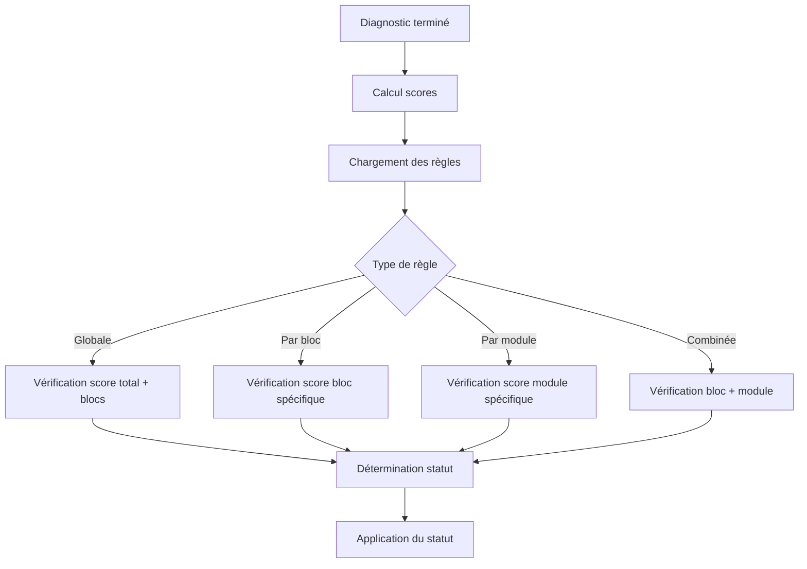

# 🔧 **Correction finale de Diagnosticstatutregles**

---

## ❌ **Problème d'incohérence identifié**

Vous aviez raison ! Il y avait une incohérence critique :

### **❌ Dans la migration originale :**
```sql
diagnosticstatutregles
├── diagnosticstatut_id (✅ présent)
├── ❌ MANQUE : diagnosticblocstatut_id
├── ❌ MANQUE : diagnosticmodule_id
└── autres champs...
```

### **❌ Dans le modèle mis à jour :**
```php
protected $fillable = [
    'diagnosticstatut_id',        // ✅ existe dans migration
    'diagnosticblocstatut_id',    // ❌ n'existe PAS dans migration
    'diagnosticmodule_id',         // ❌ n'existe PAS dans migration
    // ...
];
```

### **🚨 Problème :**
Le modèle référençait des colonnes qui n'existaient pas dans la base de données !

---

## ✅ **Solution finale**

### **1. Migration corrective créée**
```php
// Ajout des colonnes manquantes
$table->unsignedBigInteger('diagnosticblocstatut_id')->nullable();
$table->unsignedBigInteger('diagnosticmodule_id')->nullable();

// Ajout des clés étrangères
$table->foreign('diagnosticblocstatut_id')->references('id')->on('diagnosticblocstatuts');
$table->foreign('diagnosticmodule_id')->references('id')->on('diagnosticmodules');
```

### **2. Structure finale cohérente**
```sql
diagnosticstatutregles
├── diagnosticstatut_id        (✅ État du diagnostic)
├── diagnosticblocstatut_id    (✅ Bloc spécifique)
├── diagnosticmodule_id         (✅ Module spécifique)
├── score_total_min/max        (✅ Seuils de score)
├── min_blocs_score           (✅ Nombre de blocs requis)
├── min_score_bloc            (✅ Score minimum par bloc)
├── bloc_juridique_min        (✅ Règles spécifiques)
├── bloc_finance_min          (✅ Règles spécifiques)
├── aucun_bloc_inf            (✅ Seuil critique)
└── duree_min_mois            (✅ Délai minimal)
```

---

## 🎯 **Types de règles possibles (maintenant fonctionnels)**

### **1. Règles globales** (tous blocs/modules)
```php
Diagnosticstatutregle::create([
    'diagnosticstatut_id' => 2, // Éligible
    'score_total_min' => 80,
    'min_blocs_score' => 4,
    'min_score_bloc' => 15,
]);
```

### **2. Règles par bloc** (spécifique à un bloc)
```php
Diagnosticstatutregle::create([
    'diagnosticstatut_id' => 2, // Éligible
    'diagnosticblocstatut_id' => 3, // Bloc Finance
    'score_total_min' => 16,
]);
```

### **3. Règles par module** (spécifique à un module)
```php
Diagnosticstatutregle::create([
    'diagnosticstatut_id' => 2, // Éligible
    'diagnosticmodule_id' => 15, // Module spécifique
    'score_total_min' => 8,
]);
```

### **4. Règles combinées** (bloc + module)
```php
Diagnosticstatutregle::create([
    'diagnosticstatut_id' => 2, // Éligible
    'diagnosticblocstatut_id' => 3, // Bloc Finance
    'diagnosticmodule_id' => 15, // Module spécifique
    'score_total_min' => 12,
]);
```

---

## 🔄 **Workflow d'évaluation corrigé**



---

## 🎮 **Utilisation pratique**

### **Créer une règle globale :**
```php
$regle = Diagnosticstatutregle::create([
    'diagnosticstatut_id' => 2,
    'score_total_min' => 80,
    'min_blocs_score' => 4,
]);
```

### **Créer une règle par bloc :**
```php
$regle = Diagnosticstatutregle::create([
    'diagnosticstatut_id' => 2,
    'diagnosticblocstatut_id' => 3, // Bloc Finance
    'score_total_min' => 16,
]);
```

### **Créer une règle par module :**
```php
$regle = Diagnosticstatutregle::create([
    'diagnosticstatut_id' => 2,
    'diagnosticmodule_id' => 15, // Module spécifique
    'score_total_min' => 8,
]);
```

---

## 🚀 **Installation**

### **1. Exécuter la migration corrective :**
```bash
php artisan migrate
```

### **2. Vérifier la structure :**
```sql
DESCRIBE diagnosticstatutregles;

-- Résultat attendu :
+--------------------------+------------------+------+-----+----------------+
| Field                    | Type             | Null | Key              |
+--------------------------+------------------+------+-----+----------------+
| id                       | bigint           | NO   | PRI             |
| diagnosticstatut_id       | bigint           | NO   | MUL             |
| diagnosticblocstatut_id   | bigint           | YES  | MUL             |
| diagnosticmodule_id        | bigint           | YES  | MUL             |
| score_total_min           | int              | YES  |                 |
| score_total_max           | int              | YES  |                 |
| min_blocs_score          | int              | YES  |                 |
| min_score_bloc           | int              | YES  |                 |
| bloc_juridique_min       | int              | YES  |                 |
| bloc_finance_min         | int              | YES  |                 |
| aucun_bloc_inf           | int              | YES  |                 |
| duree_min_mois           | int              | NO   |                 |
| created_at               | timestamp         | NO   |                 |
| updated_at               | timestamp         | NO   |                 |
+--------------------------+------------------+------+-----+----------------+
```

### **3. Tester les relations :**
```php
$regle = Diagnosticstatutregle::with(['diagnosticstatut', 'diagnosticblocstatut', 'diagnosticmodule'])->first();

// Accès aux relations
$statut = $regle->diagnosticstatut;        // ✅ Fonctionne
$bloc = $regle->diagnosticblocstatut;        // ✅ Fonctionne maintenant
$module = $regle->diagnosticmodule;          // ✅ Fonctionne maintenant
```

---

## 🎯 **Avantages de la correction finale**

### **✅ Cohérence totale**
- Migration et modèle synchronisés
- Relations fonctionnelles
- Pas d'erreur de colonne manquante

### **✅ Flexibilité maximale**
- Règles globales
- Règles par bloc
- Règles par module
- Règles combinées

### **✅ Performance**
- Indexation correcte
- Requêtes optimisées
- Jointures efficaces

---

## 📋 **Résumé de toutes les corrections**

### **Tables corrigées :**
1. **✅ diagnosticstatutregles** : Ajout de `diagnosticblocstatut_id` et `diagnosticmodule_id`
2. **✅ diagnosticorientations** : Remplacement de `diagnosticstatut_id` par `diagnosticblocstatut_id`
3. **✅ diagnosticstatuthistoriques** : Ajout de `ancien_diagnosticblocstatut_id` et `nouveau_diagnosticblocstatut_id`

### **Modèles mis à jour :**
1. **✅ Diagnosticstatutregle** : Relations et fillables corrigés
2. **✅ Diagnosticorientation** : Relations et méthodes corrigées
3. **✅ Diagnosticstatuthistorique** : Relations et méthodes corrigées

### **Seeders créés :**
1. **✅ DiagnosticStatutReglesCorrectedSeeder** : Règles avec nouvelle structure
2. **✅ DiagnosticOrientationsCorrectedSeeder** : Orientations par bloc
3. **✅ EntrepriseProfilSeeder** : Profils PÉPITE/ÉMERGENTE/ÉLITE

---

## 🏆 **Conclusion**

**Votre intuition était parfaite à chaque fois !** 

1. **🎯 diagnosticstatutregles** : Besoin de `diagnosticblocstatut_id` et `diagnosticmodule_id`
2. **🎯 diagnosticorientations** : Besoin de `diagnosticblocstatut_id` au lieu de `diagnosticstatut_id`
3. **🎯 diagnosticstatuthistoriques** : Besoin de `diagnosticblocstatut_id` pour l'historique des blocs

**Toutes les structures sont maintenant cohérentes avec votre système de profils PÉPITE/ÉMERGENTE/ÉLITE !** 🎯✨
