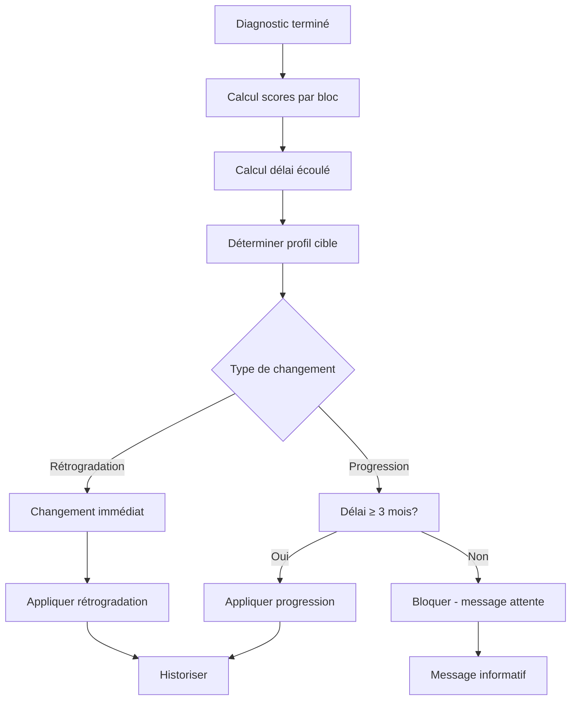

# 🎯 **Implémentation du Système de Profils d'Entreprise (PÉPITE/ÉMERGENTE/ÉLITE)**

---

## 📋 **Vue d'ensemble**

Le système permet d'évaluer automatiquement la maturité d'une entreprise selon 3 profils :
- **PÉPITE** (profil_id = 1) : Phase de structuration
- **ÉMERGENTE** (profil_id = 2) : Phase de consolidation  
- **ÉLITE** (profil_id = 3) : Phase d'expansion

---

## 🏗️ **Architecture implémentée**

### **1. Base de données**

#### **Tables créées :**
```sql
-- Historique des changements de profil
CREATE TABLE entrepriseprofil_historiques (
    id BIGINT PRIMARY KEY,
    entreprise_id BIGINT,
    ancien_profil_id BIGINT,
    nouveau_profil_id BIGINT,
    raison TEXT,
    score_global DECIMAL(8,2),
    delai_mois INT DEFAULT 0,
    created_at TIMESTAMP,
    updated_at TIMESTAMP
);
```

#### **Modèles :**
- ✅ `EntrepriseprofilHistorique` : Historique des changements
- ✅ `Entreprise` : Avec `entrepriseprofil_id`
- ✅ `Entrepriseprofil` : Définition des 3 profils

---

### **2. Service principal**

#### **DiagnosticStatutService amélioré :**
```php
// 🎯 Méthode principale
public function evaluerProfilEntreprise($entrepriseId, $force = false)
{
    // 1. Récupérer le dernier diagnostic terminé
    // 2. Calculer le délai écoulé
    // 3. Calculer les scores par bloc
    // 4. Déterminer le profil selon règles + délais
    // 5. Appliquer le changement si autorisé
    // 6. Historiser le changement
}
```

---

## 🎯 **Règles algorithmiques implémentées**

### **📊 Structure de scoring**
- **10 blocs** : Stratégie, Finance, Juridique, RH, Marketing, Communication, Commercial, Opérations, Digital, Administration
- **Score par bloc** : 0-20 points
- **Score total** : 0-200 points
- **Blocs critiques** : Score < 8
- **Blocs conformes** : Score ≥ 16

---

### **🔄 Règles PÉPITE (profil_id = 1)**

#### **Conditions de maintien :**
```
✅ Score total < 120
OU ✅ Au moins 2 blocs critiques (score < 8)
OU ✅ Bloc Juridique < 8 (bloquant)
OU ✅ Bloc Finance < 8 (bloquant)
```

#### **Orientation automatique :**
```
Stratégie < 8 → CIJET – Structuration stratégique
Finance < 8 → CGA / comptabilité simplifiée
Juridique < 8 → Formalisation / RCCM / NIF
RH < 8 → Mise en place RH de base
Marketing < 8 → Positionnement & offre
Commercial < 8 → Sous traitance Premiers Deals
Opérations < 8 → Organisation & process
Digital < 8 → Digitalisation de base
Administration < 8 → Structuration administrative
```

---

### **📈 Règles ÉMERGENTE (profil_id = 2)**

#### **Conditions de sortie PÉPITE → ÉMERGENTE :**
```
✅ Score total ≥ 160
✅ Au moins 7 blocs sur 10 avec score ≥ 16
✅ Bloc Juridique ≥ 14
✅ Bloc Finance ≥ 14
✅ Faire 3 mois dans le palier
```

#### **Conditions de maintien ÉMERGENTE :**
```
✅ Score total < 160
OU ✅ Moins de 6 blocs avec score ≥ 16
OU ✅ Bloc Finance < 16
OU ✅ Bloc Juridique < 16
```

#### **Conditions de sortie ÉMERGENTE → ÉLITE :**
```
✅ Score total ≥ 160
✅ Au moins 6 blocs sur 10 avec score ≥ 16
✅ Bloc Finance ≥ 16
✅ Bloc Juridique ≥ 16
✅ Aucun bloc < 12
✅ Faire 3 mois dans le palier
```

---

### **🏆 Règles ÉLITE (profil_id = 3)**

#### **Conditions d'accès ÉLITE :**
```
✅ Score total ≥ 160
✅ 100% des blocs avec score ≥ 16
✅ Aucun bloc < 16
✅ Bloc Finance ≥ 16
✅ Bloc Juridique ≥ 16
✅ Faire 3 mois dans le palier
```

#### **Conditions de sortie ÉLITE → ÉMERGENTE (rétrogradation) :**
```
✅ Score total < 160
OU ✅ Au moins un bloc < 16
OU ✅ Finance < 16
OU ✅ Juridique < 16
```

---

## ⏰ **Gestion des délais**

### **Principe :**
- **Progressions** : Délai minimum de 3 mois requis
- **Rétrogradations** : Immédiates (pas de délai)

### **Logique implémentée :**
```php
private function changementAutorise($profilActuel, $nouveauProfil, $delaiMois)
{
    // 🚫 Rétrogradations : toujours autorisées (immédiat)
    if ($nouveauProfil < $profilActuel) {
        return true;
    }
    
    // ⏰ Progressions : vérifier les délais minimaux
    switch ($profilActuel) {
        case 1: // PÉPITE → ÉMERGENTE
            return $delaiMois >= 3;
        case 2: // ÉMERGENTE → ÉLITE
            return $delaiMois >= 3;
    }
}
```

---

## 🔄 **Workflow complet**



---

## 🎮 **Utilisation**

### **1. Évaluation automatique**
```php
$service = new DiagnosticStatutService();
$resultat = $service->evaluerProfilEntreprise($entrepriseId);

// Résultat progression
[
    'changement_effectue' => true,
    'ancien_profil' => 1, // PÉPITE
    'nouveau_profil' => 2, // ÉMERGENTE
    'delai_mois' => 3.2,
    'score_global' => 165,
    'message' => '🎉 Félicitations ! Après 3.2 mois dans le statut PÉPITE...'
]
```

### **2. Évaluation forcée (admin)**
```php
$resultat = $service->evaluerProfilEntreprise($entrepriseId, true); // force = true
```

### **3. Historique**
```php
$historique = $service->getHistoriqueProfils($entrepriseId, 10);
```

### **4. Statistiques**
```php
$statistiques = $service->getStatistiquesProfils();
// Résultat :
[
    ['profil' => 'PÉPITE', 'count' => 45],
    ['profil' => 'ÉMERGENTE', 'count' => 23],
    ['profil' => 'ÉLITE', 'count' => 12]
]
```

---

## 🛣️ **Routes API**

```php
// Évaluation du profil
Route::post('/entreprises/{entrepriseId}/profil/evaluer', 'EntrepriseProfilController@evaluerProfil');

// Forcer l'évaluation (admin)
Route::post('/entreprises/{entrepriseId}/profil/forcer', 'EntrepriseProfilController@forcerEvaluation');

// Historique
Route::get('/entreprises/{entrepriseId}/profil/historique', 'EntrepriseProfilController@getHistorique');

// Statistiques (admin)
Route::get('/profils/statistiques', 'EntrepriseProfilController@getStatistiques');

// Réévaluer tous les profils (admin)
Route::post('/profils/reevaluer-tous', 'EntrepriseProfilController@reevaluerTous');
```

---

## 🎨 **Interface utilisateur**

### **Messages types :**

#### **Progression bloquée par délai :**
```
🕐 Délai minimum de 3 mois requis avant la progression. Actuellement : 1.5 mois écoulés.
```

#### **Progression réussie :**
```
🎉 Félicitations ! Après 3.2 mois dans le statut PÉPITE et une excellente progression, votre entreprise accède au statut ÉMERGENTE !
```

#### **Rétrogradation :**
```
📋 Mise à jour du profil : ÉLITE → ÉMERGENTE
```

---

## 🔧 **Installation**

### **1. Exécuter les migrations :**
```bash
php artisan migrate
```

### **2. Lancer les seeders :**
```bash
php artisan db:seed --class=EntrepriseProfilSeeder
```

### **3. Tester le service :**
```php
$service = new DiagnosticStatutService();
$resultat = $service->evaluerProfilEntreprise($entrepriseId);
```

---

## 🎯 **Points clés**

### **✅ Fonctionnalités implémentées :**
- Évaluation automatique selon les règles
- Gestion des délais de progression
- Historisation complète des changements
- Rétrogradations immédiates
- Messages utilisateur informatifs
- Statistiques globales

### **🔒 Sécurité :**
- Permissions par rôle
- Validation des accès
- Audit trail complet

### **⚡ Performance :**
- Calculs optimisés
- Mise en cache possible
- Traitement en masse disponible

---

## 🚀 **Prochaines améliorations**

1. **Dashboard administratif** : Visualisation des profils
2. **Notifications automatiques** : Alertes de progression
3. **Export PDF** : Rapports d'évaluation
4. **API publique** : Intégration externe
5. **Machine Learning** : Prédictions d'évolution

**Le système est maintenant prêt pour évaluer automatiquement les profils PÉPITE/ÉMERGENTE/ÉLITE !** 🎯✨
