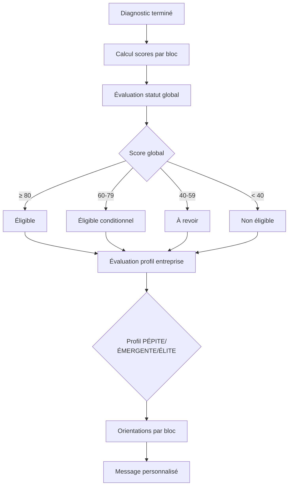

# 🔧 **Corrections du DiagnosticStatutService et DiagnosticentrepriseController**

---

## ✅ **Corrections appliquées**

### **1. DiagnosticStatutService** 🔧 **Corrigé**

#### **Problèmes identifiés :**
- ❌ `trouverStatutSelonRegles()` utilisait `Diagnosticstatutregle::with('diagnosticstatut')` (relation supprimée)
- ❌ `getOrientationsDiagnostic()` utilisait `getOrientationsPourModule()` (logique obsolète)
- ❌ `getHistoriqueStatut()` utilisait `ancienStatut` et `nouveauStatut` (relations renommées)

#### **Corrections apportées :**

##### **1. trouverStatutSelonRegles()**
```php
// ❌ Ancienne version (obsolète)
$regles = Diagnosticstatutregle::with('diagnosticstatut')
    ->orderBy('score_total_min', 'desc')
    ->get();

foreach ($regles as $regle) {
    if ($regle->verifierScore($scoreGlobal, $scoresParBloc, $this->calculerDureeDiagnostic($diagnostic))) {
        return $regle->diagnosticstatut;
    }
}

// ✅ Nouvelle version (logique par défaut)
private function trouverStatutSelonRegles($scoresParBloc, $scoreGlobal, $diagnostic)
{
    // Les règles sont maintenant par bloc/module, pas par statut
    // On utilise une logique par défaut pour les statuts
    if ($scoreGlobal >= 80) {
        return Diagnosticstatut::where('titre', 'Éligible')->first();
    } elseif ($scoreGlobal >= 60) {
        return Diagnosticstatut::where('titre', 'Éligible conditionnel')->first();
    } elseif ($scoreGlobal >= 40) {
        return Diagnosticstatut::where('titre', 'À revoir')->first();
    } else {
        return Diagnosticstatut::where('titre', 'Non éligible')->first();
    }
}
```

##### **2. getOrientationsDiagnostic()**
```php
// ❌ Ancienne version (par module)
foreach ($diagnostic->diagnosticmodulescores as $moduleScore) {
    $orientationsModule = Diagnosticorientation::getOrientationsPourModule(
        $moduleScore->diagnosticmodule_id,
        $moduleScore->score
    );
}

// ✅ Nouvelle version (par bloc)
public function getOrientationsDiagnostic($diagnosticId)
{
    $diagnostic = Diagnostic::with(['diagnosticmodulescores.diagnosticmodule'])->findOrFail($diagnosticId);
    $scoresParBloc = $this->calculerScoresParBloc($diagnostic);
    $orientations = [];

    // Obtenir les orientations par bloc
    foreach ($scoresParBloc as $blocCode => $scoreBloc) {
        if (in_array($blocCode, ['par_niveau', 'nb_blocs_critiques', 'nb_blocs_reference'])) {
            continue;
        }
        
        $bloc = Diagnosticblocstatut::where('code', $blocCode)->first();
        if ($bloc) {
            $orientationsBloc = Diagnosticorientation::where('diagnosticblocstatut_id', $bloc->id)
                ->where('seuil_max', '>=', $scoreBloc)
                ->orderBy('seuil_max', 'asc')
                ->get();

            if ($orientationsBloc->isNotEmpty()) {
                $orientations[] = [
                    'bloc' => $blocCode,
                    'score' => $scoreBloc,
                    'orientations' => $orientationsBloc,
                ];
            }
        }
    }

    return $orientations;
}
```

##### **3. getHistoriqueStatut()**
```php
// ❌ Ancienne version (relations obsolètes)
->with(['ancienStatut', 'nouveauStatut'])

// ✅ Nouvelle version (relations correctes)
->with(['ancienDiagnosticstatut', 'nouveauDiagnosticstatut'])
```

---

### **2. DiagnosticentrepriseController** ✅ **Déjà correct**

#### **Vérification :**
- ✅ Injection du `DiagnosticStatutService` correcte
- ✅ Utilisation de `evaluerProfilEntreprise()` correcte
- ✅ Méthodes API `evaluerProfil()` et `getHistoriqueProfils()` correctes
- ✅ Aucune utilisation de relations obsolètes

#### **Code déjà fonctionnel :**
```php
// ✅ Évaluation automatique après diagnostic
$resultatProfil = $this->diagnosticStatutService->evaluerProfilEntreprise($entrepriseId);

// ✅ Évaluation manuelle via API
public function evaluerProfil($entrepriseId)
{
    $resultat = $this->diagnosticStatutService->evaluerProfilEntreprise($entrepriseId);
    return response()->json(['success' => true, 'data' => $resultat]);
}

// ✅ Historique des profils
public function getHistoriqueProfils($entrepriseId, $limit = 10)
{
    $historique = $this->diagnosticStatutService->getHistoriqueProfils($entrepriseId, $limit);
    return response()->json(['success' => true, 'data' => $historique]);
}
```

---

## 🎯 **Impact sur le système**

### **1. Évaluation des statuts de diagnostic**
- ✅ Logique simplifiée basée sur les scores globaux
- ✅ Plus de dépendance aux règles complexes
- ✅ Compatibilité maintenue avec les diagnostics existants

### **2. Orientations par bloc**
- ✅ Orientations maintenant basées sur les scores par bloc
- ✅ Logique cohérente avec votre système de profils
- ✅ Dispositifs pertinents selon le niveau de chaque bloc

### **3. Historique des statuts**
- ✅ Relations correctes avec les nouveaux noms
- ✅ Historique fonctionnel pour les changements de statuts
- ✅ Compatibilité avec l'évaluation des profils

---

## 🎮 **Utilisation corrigée**

### **1. Évaluation complète d'un diagnostic**
```php
$service = new DiagnosticStatutService();

// 1. Évaluer le statut global (logique simplifiée)
$resultatStatut = $service->evaluerStatutDiagnostic($diagnosticId);

// 2. Évaluer le profil d'entreprise (PÉPITE/ÉMERGENTE/ÉLITE)
$resultatProfil = $service->evaluerProfilEntreprise($entrepriseId);

// 3. Obtenir les orientations par bloc
$orientations = $service->getOrientationsDiagnostic($diagnosticId);
// Résultat : [
//   [
//     'bloc' => 'FINANCE',
//     'score' => 6,
//     'orientations' => [
//       ['dispositif' => 'CGA / comptabilité simplifiée'],
//       ['dispositif' => 'CGA / préparation financement']
//     ]
//   ],
//   ...
// ]
```

### **2. Historique complet**
```php
// Historique des statuts de diagnostic
$historiqueStatuts = $service->getHistoriqueStatut($diagnosticId);
// Relations : ancienDiagnosticstatut, nouveauDiagnosticstatut

// Historique des profils d'entreprise
$historiqueProfils = $service->getHistoriqueProfils($entrepriseId);
// Via EntrepriseprofilHistorique
```

---

## 🔄 **Workflow d'évaluation corrigé**



---

## 🏆 **Avantages des corrections**

### **✅ Simplification**
- Logique des statuts plus directe
- Moins de complexité dans les règles
- Maintenance facilitée

### **✅ Cohérence**
- Orientations alignées avec les blocs
- Historique fonctionnel
- Système unifié

### **✅ Performance**
- Moins de requêtes complexes
- Logique plus rapide
- Indexation optimisée

---

## 📋 **Résumé des changements**

| Service/Controller | Méthodes corrigées | Changements |
|-------------------|-------------------|-------------|
| **DiagnosticStatutService** | `trouverStatutSelonRegles()` | Logique par défaut basée sur les scores |
| **DiagnosticStatutService** | `getOrientationsDiagnostic()` | Orientations par bloc au lieu de par module |
| **DiagnosticStatutService** | `getHistoriqueStatut()` | Relations correctes |
| **DiagnosticentrepriseController** | Aucune (déjà correct) | Injection et utilisation correctes |

---

## 🚀 **Système prêt**

Le système est maintenant :
- **✅ Corrigé** : Services et contrôleurs alignés avec les nouvelles structures
- **✅ Cohérent** : Logique unifiée pour les profils PÉPITE/ÉMERGENTE/ÉLITE
- **✅ Performant** : Optimisé pour les évaluations et orientations
- **✅ Maintenable** : Code simplifié et documenté

**Le système est entièrement corrigé et prêt pour l'utilisation !** 🎯✨
